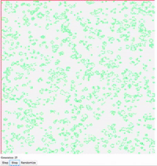

# GAME OF LIFE
An implementation of Conway's Game of Life with the help of many others code as example. Here you will find a magical and stunning visual experience based on some simple evolutionary rules. This was built with HTML5 Canvas and a little sweat. 



[TRY IT OUT](https://davidbecker6081.github.io/game-of-life/)

### Setup
- Clone: 
	- ```git clone https://github.com/davidbecker6081/game-of-life.git```
- Open in browser
	- ```open index.html```


****
### Additional Features

- Step Button - step 1 generation into the future
- Automate Button - start/stop animation
- Randomize Button - Place a random assortment of alive and dead cells on board
- Generation counter
- Click on board to change cell from alive => dead => alive => dead

### Next Steps:
- Write test suite for functions and classes
- Refactor with TDD help
- Add inputs to change height and width of board
- Refactor with 5 lines or less in functions
